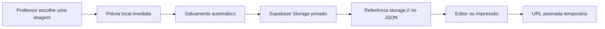

# Arquitetura de imagens e escala — 22/09/2026

## Objetivo

Retirar as imagens em Base64 do JSON das provas. O banco passa a guardar referências curtas e as páginas de listagem deixam de baixar questões completas. Isso reduz o volume transferido a cada salvamento e a carga gerada por vários usuários acessando o sistema ao mesmo tempo.

## Implementação

- `js/image-storage.js` encontra imagens Base64, evita enviar a mesma imagem duas vezes, faz upload e substitui o conteúdo por `storage://exam-images/...`.
- Ao abrir uma prova, editar um item do banco ou imprimir, as referências recebem URLs assinadas válidas por 24 horas. O cache local é renovado antes de expirar.
- Logo e imagens das questões usam o mesmo fluxo.
- Enquanto a imagem ainda não foi salva, a prévia continua usando o conteúdo local. O usuário vê o andamento no status de salvamento automático.
- O dashboard e a coordenação carregam apenas metadados, `questions_count` e `questions_score_total`. As questões completas são buscadas somente quando uma ação realmente precisa delas.
- O banco de questões resolve imagens somente ao inserir ou editar a questão escolhida.

## Banco e Storage

Ordem recomendada para ativar toda a otimização:

1. Executar `setup_supabase.sql` para criar os campos de resumo e atualizar o gatilho que os mantém sincronizados.
2. Executar `setup_storage.sql` para criar o bucket privado `exam-images`, limitar cada arquivo a 5 MB e instalar as políticas.
3. Publicar os arquivos do site.

O frontend também possui compatibilidade de implantação: enquanto os campos de resumo ou o bucket ainda não existirem, as listagens voltam à consulta completa e novos uploads permanecem em Base64. Isso evita interromper o ambiente publicado, mas a redução de tráfego só começa depois da aplicação dos dois scripts.

Não é necessária migração em lote neste ambiente de teste. Qualquer Base64 já existente é transferido para o Storage no próximo salvamento da prova.

## Efeito prático

- A aparência das provas permanece igual.
- O primeiro salvamento de uma imagem pode levar um pouco mais e mostra `Enviando imagens 1/…`.
- Os salvamentos seguintes ficam bem menores, pois enviam referências em vez dos bytes das imagens.
- Dashboard e coordenação abrem mais rápido e consomem menos tráfego, mesmo quando as provas têm muitas imagens.
- A concorrência no banco melhora porque consultas de listagem e autosaves transportam muito menos dados. A proteção por versão continua evitando que duas abas sobrescrevam silenciosamente a mesma prova.

## Limite conhecido e operação

Os objetos são imutáveis e não são excluídos automaticamente quando uma imagem sai de uma prova. Isso evita quebrar duplicações e questões compartilhadas que ainda apontem para o mesmo arquivo. Antes de uso em produção em grande escala, deve ser criada uma rotina administrativa periódica para remover apenas objetos sem referência em `exams` e `question_bank`.

## Reversão

Definir `IMAGE_STORAGE_ENABLED: false` em `config.js` interrompe novos uploads sem impedir a abertura de dados Base64 antigos. Referências já migradas continuam exigindo o módulo e o bucket; por isso a reversão completa deve manter o Storage disponível até converter esses registros novamente.
